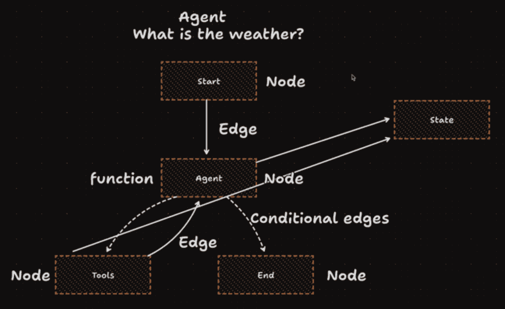
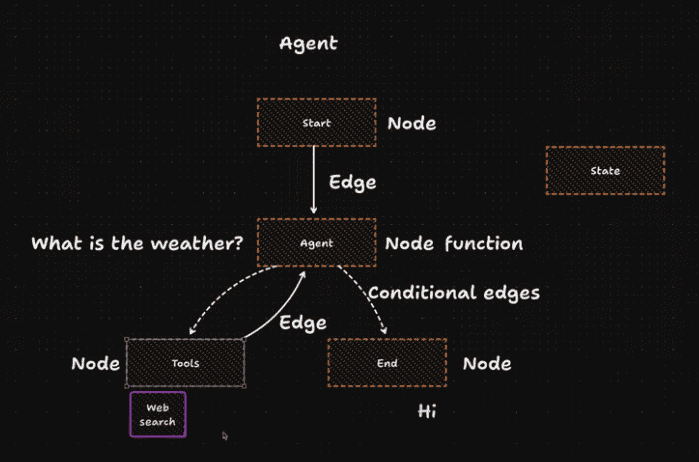

> 13 - September - 2025

# AI Agent - CLI ChatBot

An intelligent conversational agent powered by LangGraph + Groq.

## 🌟 Features

1. A user can have chat with the Agent
2. Agent can browse the internet
3. Agent can remember the full conversation

### 🤖 AI Agent | Learning Context

> 💡 This is not just a chatbot — it's an **AI agent**:  

- `LLM` ==> is the brain
- `Tools` ==> is hand (can perform ***actions*** like browsing)
- `LLM` + `Tools` ==> `AI Agent`
- [Lang-Graph][langGraph] is especially use for building `AI Agent`
  - The nervous system that coordinates thoughts & ***actions***
- LLM tell us to execute the tool
  - inside tool LLM send our input as an query
  - so tools send the message into LLM and LLM send us that message by formatted way
  
- Message have 3 type
  - Human Message
  - AI Message
  - Tool Message
    - after tool execute, generated message send back to the AI

[langGraph]:https://www.langchain.com

### 📦 Packages

| Packages                      | Usage                                    |
|-------------------------------|------------------------------------------|
| bun add @langchain/core       | Core utils (for prompts, messages, etc.) |
| bun add @langchain/langgraph  | Manage stateful conversation flow        |
| bun add @langchain/groq       | Connects fast with LLMs                  |
| bun add @langchain/tavily     | Searching tools for LLM                  |

> To install dependencies:

This project was created using `bun init`

```bash
bun install
```

To run:

```bash
bun start
```

### 🌐 References

- [Js LangChain Doc](https://js.langchain.com/docs/integrations/chat/groq)
- [Js LangGraph Doc](https://langchain-ai.github.io/langgraphjs/tutorials/quickstart)
- [Groq API Key](https://console.groq.com/keys)
- [Tavily API Key](https://app.tavily.com/home)
- [Tavily Doc](https://docs.tavily.com/documentation/about)

### ✅ Final Checklist Before Running

- create `.env` file with proper `key = value`

### Conceptual Data Flow




## Example Questions:-

- when was world war 2 happen?
- when was iphone 17 launched?
- what is the weather in Dhaka?
- what is the current stork market info about dhaka?
  
## Example of:- AI Message Response Structure

```js
{
  "messages": [
    {
      "lc": 1,
      "type": "constructor",
      "id": [
        "langchain_core",
        "messages",
        "HumanMessage"
      ],
      "kwargs": {
        "content": "Hi",
        "additional_kwargs": {},
        "response_metadata": {},
        "id": "d5afcde2-f2e2-4e4d-854d-065f0ade6478"
      }
    },
    {
      "lc": 1,
      "type": "constructor",
      "id": [
        "langchain_core",
        "messages",
        "AIMessage"
      ],
      "kwargs": {
        "content": "Hello! How can I help you today?",
        "additional_kwargs": {},
        "tool_calls": [],
        "invalid_tool_calls": [],
        "usage_metadata": {
          "input_tokens": 746,
          "output_tokens": 31,
          "total_tokens": 777
        },
        "response_metadata": {
          "tokenUsage": {
            "completionTokens": 31,
            "promptTokens": 746,
            "totalTokens": 777
          },
          "finish_reason": "stop",
          "id": "chatcmpl-c322d080-0ec6-48a6-a404-8d00d6a9444b",
          "object": "chat.completion",
          "created": 1757941594,
          "model": "openai/gpt-oss-120b",
          "usage": {
            "queue_time": 0.054119138,
            "prompt_tokens": 746,
            "prompt_time": 0.034286912,
            "completion_tokens": 31,
            "completion_time": 0.063442637,
            "total_tokens": 777,
            "total_time": 0.097729549
          },
          "usage_breakdown": null,
          "system_fingerprint": "fp_ed9190d8b7",
          "x_groq": {
            "id": "req_01k56qqyb8et99z76vh5q3jad5"
          },
          "service_tier": "on_demand"
        },
        "id": "10b8f62a-0a6b-47df-a83d-f2a37f079b8e"
      }
    }
  ]
}
```

## Example of:- Tools Message Response Structure

```js
{
  "messages": [
    {
      "lc": 1,
      "type": "constructor",
      "id": [
        "langchain_core",
        "messages",
        "HumanMessage"
      ],
      "kwargs": {
        "content": "what is the weather in Dhaka?",
        "additional_kwargs": {},
        "response_metadata": {},
        "id": "c4b3b403-5146-4a06-937f-71a355b14e97"
      }
    },
    {
      "lc": 1,
      "type": "constructor",
      "id": [
        "langchain_core",
        "messages",
        "AIMessage"
      ],
      "kwargs": {
        "content": "",
        "additional_kwargs": {
          "tool_calls": [
            {
              "id": "fc_bbf363e1-9f68-4344-a88d-a664def5858c",
              "type": "function",
              "function": {
                "name": "tavily_search",
                "arguments": "{\"query\":\"current weather Dhaka\",\"searchDepth\":\"basic\",\"timeRange\":\"day\",\"topic\":\"news\"}"
              }
            }
          ]
        },
        "tool_calls": [
          {
            "name": "tavily_search",
            "args": {
              "query": "current weather Dhaka",
              "searchDepth": "basic",
              "timeRange": "day",
              "topic": "news"
            },
            "type": "tool_call",
            "id": "fc_bbf363e1-9f68-4344-a88d-a664def5858c"
          }
        ],
        "invalid_tool_calls": [],
        "usage_metadata": {
          "input_tokens": 754,
          "output_tokens": 110,
          "total_tokens": 864
        },
        "response_metadata": {
          "tokenUsage": {
            "completionTokens": 110,
            "promptTokens": 754,
            "totalTokens": 864
          },
          "finish_reason": "tool_calls",
          "id": "chatcmpl-0ba1c0d1-f8dd-469e-9666-e75170ffe4d7",
          "object": "chat.completion",
          "created": 1757941640,
          "model": "openai/gpt-oss-120b",
          "usage": {
            "queue_time": 0.046198005,
            "prompt_tokens": 754,
            "prompt_time": 0.035137925,
            "completion_tokens": 110,
            "completion_time": 0.218349241,
            "total_tokens": 864,
            "total_time": 0.253487166
          },
          "usage_breakdown": null,
          "system_fingerprint": "fp_3a688838c3",
          "x_groq": {
            "id": "req_01k56qsb9wffyabttcnephbm4j"
          },
          "service_tier": "on_demand"
        },
        "id": "8689a237-d0d2-4ad4-8741-989f42b253d9"
      }
    }
  ]
}
```
